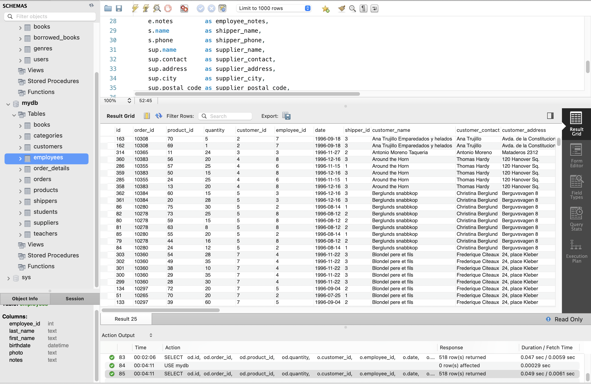
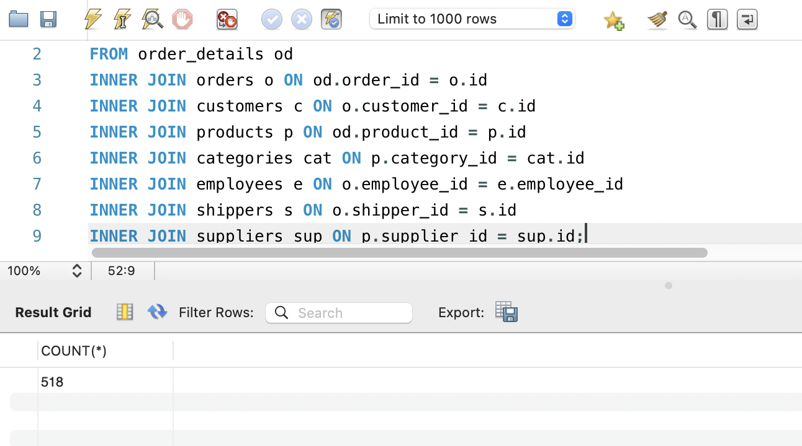
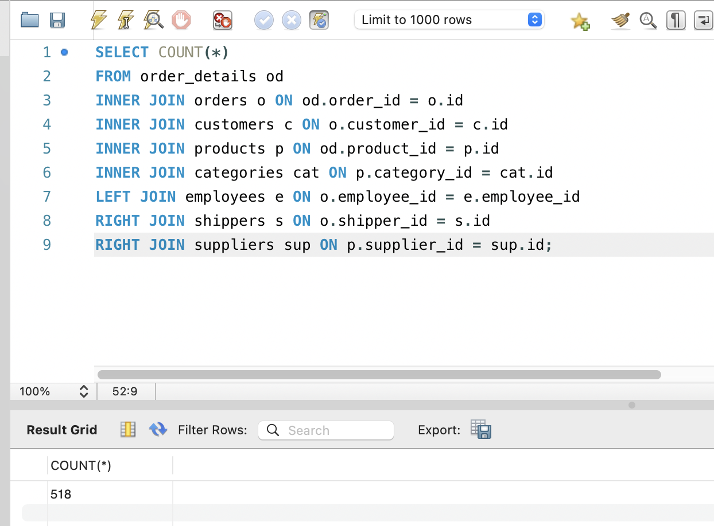
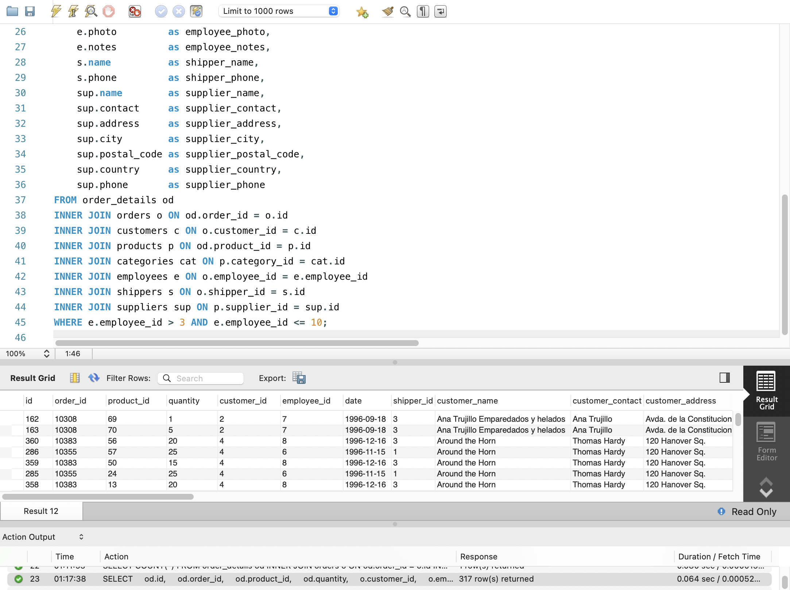
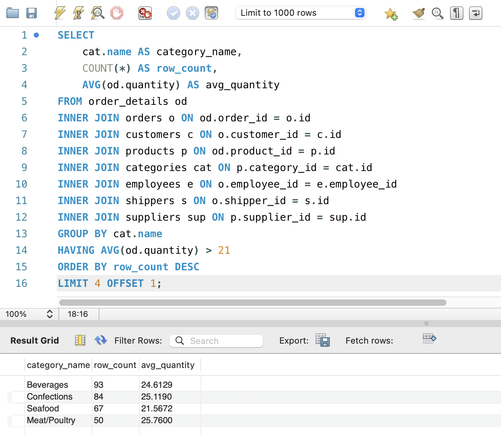

# GoIT RDB Homework 04

Цей репозиторій містить результати виконання домашнього завдання №4 з курсу Реляційних Баз Даних (GoIT).

## Завдання 1-2: Створення та наповнення БД "LibraryManagement"

Створено базу даних для керування бібліотекою книг згідно з вимогами.

**Схема БД:** `LibraryManagement`

### SQL Код (Створення та наповнення)

```sql
CREATE SCHEMA LibraryManagement;
USE LibraryManagement;

CREATE TABLE authors (
    author_id INT AUTO_INCREMENT PRIMARY KEY,
    author_name VARCHAR(255)
);

CREATE TABLE genres (
    genre_id INT AUTO_INCREMENT PRIMARY KEY,
    genre_name VARCHAR(255)
);

CREATE TABLE books (
    book_id INT AUTO_INCREMENT PRIMARY KEY,
    title VARCHAR(255),
    publication_year YEAR,
    author_id INT,
    genre_id INT,
    FOREIGN KEY (author_id) REFERENCES authors(author_id),
    FOREIGN KEY (genre_id) REFERENCES genres(genre_id)
);

CREATE TABLE users (
    user_id INT AUTO_INCREMENT PRIMARY KEY,
    username VARCHAR(255),
    email VARCHAR(255)
);

CREATE TABLE borrowed_books (
    borrow_id INT AUTO_INCREMENT PRIMARY KEY,
    book_id INT,
    user_id INT,
    borrow_date DATE,
    return_date DATE,
    FOREIGN KEY (book_id) REFERENCES books(book_id),
    FOREIGN KEY (user_id) REFERENCES users(user_id)
);

-- Тестові дані
INSERT INTO authors (author_name) VALUES ('Джордж Орвелл'), ('Дж.К. Роулінг');
INSERT INTO genres (genre_name) VALUES ('Антиутопія'), ('Фентезі');
INSERT INTO books (title, publication_year, author_id, genre_id) VALUES ('1984', 1949, 1, 1), ('Гаррі Поттер', 1997, 2, 2);
INSERT INTO users (username, email) VALUES ('ivan_petrenko', 'ivan@example.com'), ('maria_koval', 'maria@example.com');
INSERT INTO borrowed_books (book_id, user_id, borrow_date, return_date) VALUES (1, 1, '2023-10-01', '2023-10-15');
```

**Скріншоти виконання:**


## Завдання 3: Об'єднання таблиць (INNER JOIN)

Написано запит для об'єднання таблиць із бази даних (`order_details`, `orders`, `customers`, `products`, `categories`, `employees`, `shippers`, `suppliers`).

### SQL Код

```sql
USE mydb;
SELECT
    od.id,
    od.order_id,
    od.product_id,
    od.quantity,
    o.customer_id,
    o.employee_id,
    o.date,
    o.shipper_id,
    c.name          as customer_name,
    c.contact       as customer_contact,
    c.address       as customer_address,
    c.city          as customer_city,
    c.postal_code   as customer_postal_code,
    c.country       as customer_country,
    p.name          as product_name,
    p.unit          as product_unit,
    p.price         as product_price,
    p.supplier_id   as product_supplier_id,
    p.category_id   as product_category_id,
    cat.name        as category_name,
    cat.description as category_description,
    e.last_name     as employee_last_name,
    e.first_name    as employee_first_name,
    e.birthdate     as employee_birthdate,
    e.photo         as employee_photo,
    e.notes         as employee_notes,
    s.name          as shipper_name,
    s.phone         as shipper_phone,
    sup.name        as supplier_name,
    sup.contact     as supplier_contact,
    sup.address     as supplier_address,
    sup.city        as supplier_city,
    sup.postal_code as supplier_postal_code,
    sup.country     as supplier_country,
    sup.phone       as supplier_phone
FROM order_details od
INNER JOIN orders o ON od.order_id = o.id
INNER JOIN customers c ON o.customer_id = c.id
INNER JOIN products p ON od.product_id = p.id
INNER JOIN categories cat ON p.category_id = cat.id
INNER JOIN employees e ON o.employee_id = e.employee_id
INNER JOIN shippers s ON o.shipper_id = s.id
INNER JOIN suppliers sup ON p.supplier_id = sup.id;
```

**Скріншоти результатів:**


## Завдання 4: Модифікація запиту

Виконано наступні завдання на основі запиту з пункту 3.

### 4.1 COUNT (Кількість рядків)

```sql
SELECT COUNT(*)
FROM order_details od
INNER JOIN orders o ON od.order_id = o.id
INNER JOIN customers c ON o.customer_id = c.id
INNER JOIN products p ON od.product_id = p.id
INNER JOIN categories cat ON p.category_id = cat.id
INNER JOIN employees e ON o.employee_id = e.employee_id
INNER JOIN shippers s ON o.shipper_id = s.id
INNER JOIN suppliers sup ON p.supplier_id = sup.id;
```

**Скріншот:**


### 4.2 LEFT / RIGHT JOIN

```sql
-- Приклад заміни INNER на LEFT/RIGHT JOIN
SELECT COUNT(*)
FROM order_details od
INNER JOIN orders o ON od.order_id = o.id
INNER JOIN customers c ON o.customer_id = c.id
INNER JOIN products p ON od.product_id = p.id
INNER JOIN categories cat ON p.category_id = cat.id
LEFT JOIN employees e ON o.employee_id = e.employee_id
RIGHT JOIN shippers s ON o.shipper_id = s.id
RIGHT JOIN suppliers sup ON p.supplier_id = sup.id;
```

**Скріншот:**

**Пояснення:**
Зміна `INNER JOIN` на `LEFT JOIN` та `RIGHT JOIN` може змінити загальну кількість рядків у результаті запиту. `INNER JOIN` відфільтровує рядки, які не мають відповідностей в обох таблицях. Натомість `LEFT JOIN` повертає всі записи з лівої таблиці, а `RIGHT JOIN` — усі записи з правої таблиці, незалежно від наявності збігів (відсутні значення заповнюються `NULL`). Якщо в таблицях існують записи без відповідностей, використання цих з'єднань може призвести до збільшення кількості рядків порівняно з `INNER JOIN`. В даному випадку кількість рядків не змінилася, оскільки всі записи в таблицях мають відповідності.

### 4.3 Фільтрація за employee_id

```sql
SELECT
    od.id,
    od.order_id,
    od.product_id,
    od.quantity,
    o.customer_id,
    o.employee_id,
    o.date,
    o.shipper_id,
    c.name          as customer_name,
    c.contact       as customer_contact,
    c.address       as customer_address,
    c.city          as customer_city,
    c.postal_code   as customer_postal_code,
    c.country       as customer_country,
    p.name          as product_name,
    p.unit          as product_unit,
    p.price         as product_price,
    p.supplier_id   as product_supplier_id,
    p.category_id   as product_category_id,
    cat.name        as category_name,
    cat.description as category_description,
    e.last_name     as employee_last_name,
    e.first_name    as employee_first_name,
    e.birthdate     as employee_birthdate,
    e.photo         as employee_photo,
    e.notes         as employee_notes,
    s.name          as shipper_name,
    s.phone         as shipper_phone,
    sup.name        as supplier_name,
    sup.contact     as supplier_contact,
    sup.address     as supplier_address,
    sup.city        as supplier_city,
    sup.postal_code as supplier_postal_code,
    sup.country     as supplier_country,
    sup.phone       as supplier_phone
FROM order_details od
INNER JOIN orders o ON od.order_id = o.id
INNER JOIN customers c ON o.customer_id = c.id
INNER JOIN products p ON od.product_id = p.id
INNER JOIN categories cat ON p.category_id = cat.id
INNER JOIN employees e ON o.employee_id = e.employee_id
INNER JOIN shippers s ON o.shipper_id = s.id
INNER JOIN suppliers sup ON p.supplier_id = sup.id
WHERE e.employee_id > 3 AND e.employee_id <= 10;
```

**Скріншот:**


### 4.4 - 4.7 Групування, HAVING, ORDER BY, LIMIT

```sql
SELECT
    cat.name AS category_name,
    COUNT(*) AS row_count,
    AVG(od.quantity) AS avg_quantity
FROM order_details od
INNER JOIN orders o ON od.order_id = o.id
INNER JOIN customers c ON o.customer_id = c.id
INNER JOIN products p ON od.product_id = p.id
INNER JOIN categories cat ON p.category_id = cat.id
INNER JOIN employees e ON o.employee_id = e.employee_id
INNER JOIN shippers s ON o.shipper_id = s.id
INNER JOIN suppliers sup ON p.supplier_id = sup.id
GROUP BY cat.name
HAVING AVG(od.quantity) > 21
ORDER BY row_count DESC
LIMIT 4 OFFSET 1;
```

**Скріншоти:**

